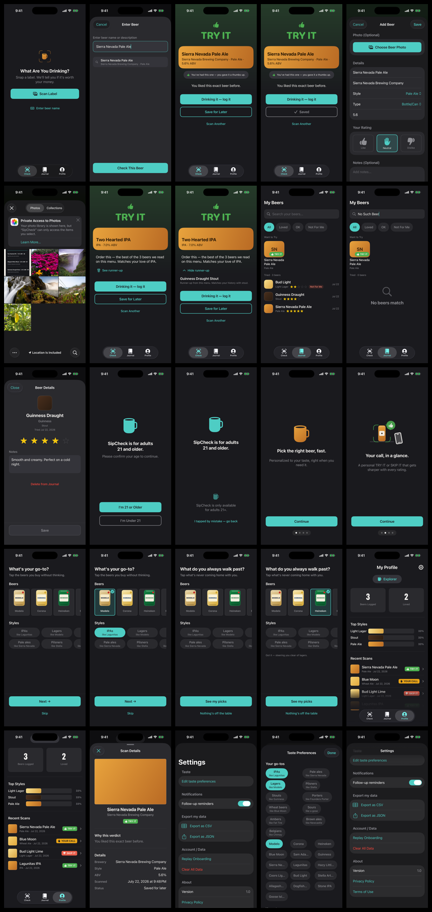
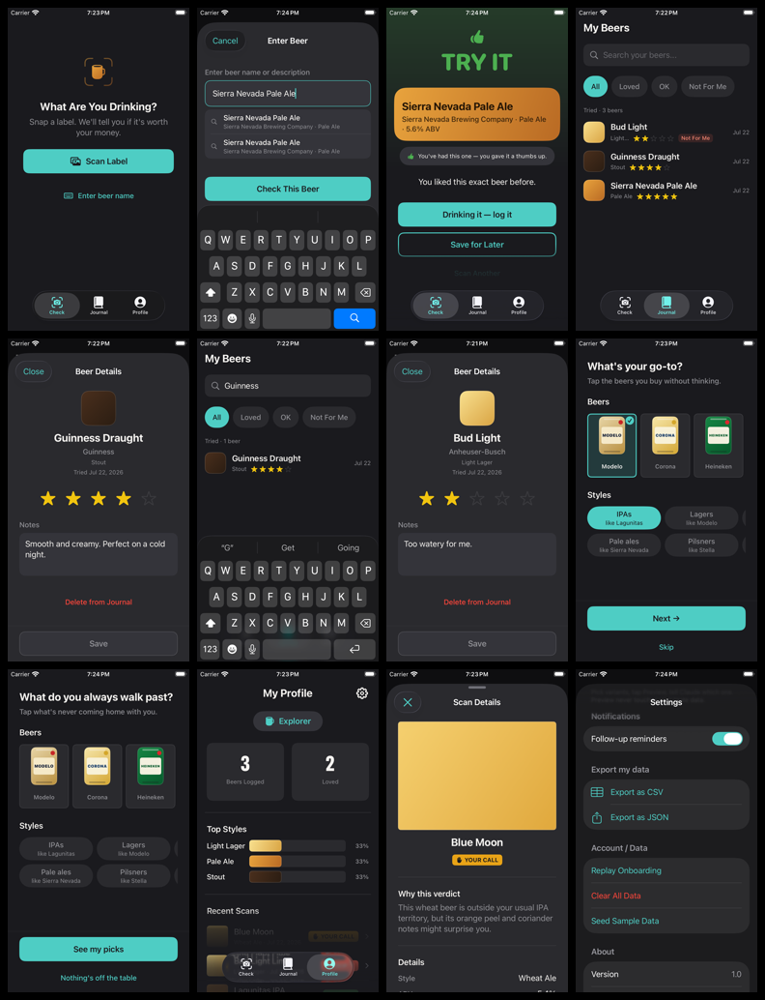

# Product Screenshot Baseline - 2026-07-22

**Status:** Immutable pre-change visual source of truth for parallel SipCheck work.
Do not replace these files in place. A later baseline should use a new dated directory.

**[Open the standalone HTML gallery](../screenshots/product-baseline-2026-07-22/index.html)**
to browse every screenshot, filter by surface, and open full-resolution images.

## Provenance

| Lane | Source | Build | Device | Size | Result |
|---|---|---|---|---|---|
| Canonical | `6f5ce77418b431dd23e082b33dfabbe0a4f8f268` | Release, Xcode 26.3 | iPhone 17 Pro, iOS 26.2 | 1206x2622 | [25-screen run passed](https://github.com/rishi09/sipcheck/actions/runs/29959748718) |
| Compact supplement | `2e8d5999f3085118db4bb9329bbaab366ba0fa05` | Debug XCUITest, Xcode 26.3 | iPhone SE (3rd generation), iOS 26.2 | 750x1334 | [13 screenshots exported; 12 curated](https://github.com/rishi09/sipcheck/actions/runs/29950213544) |

Both lanes use the dark appearance and English US locale. The canonical run fixes
the status bar at 9:41, disables CloudKit, uses seeded local data, and performs the
menu recommendation entirely on device. App source is identical across the two
SHAs: `git diff 2e8d599..6f5ce77 -- SipCheck SipCheck.xcodeproj` is empty.

Machine-readable provenance, dimensions, and SHA-256 hashes are in
[`manifest.json`](../screenshots/product-baseline-2026-07-22/manifest.json). The
sanitized copy of the canonical driver's manifest (hosted simulator UDID removed) is in
[`capture-manifest.json`](../screenshots/product-baseline-2026-07-22/capture-manifest.json).

## Canonical Gallery

- **Onboarding (8):** age gate, under-age recovery, both story pages, blank and
  selected go-to states, and blank and selected stay-away states.
- **Check (8):** idle, typed catalog suggestions, personalized verdict, saved
  confirmation, Add Beer prefill, Photos picker, menu winner, and expanded runner-up.
- **Journal (3):** seeded library plus Want to Try, no-match search, and beer detail.
- **Profile (3):** overview, scrolled recent scans, and scan detail.
- **Settings (3):** shipping Release settings, taste preferences, and data/about.

Original full-resolution images are under
[`primary/`](../screenshots/product-baseline-2026-07-22/primary/). The successful
workflow artifact also contains one AX accessibility JSON file beside every image.

## Compact Gallery

The compact set covers Check, Journal, onboarding pickers, Profile, scan detail,
and Settings. It is a layout stress supplement, not shipping-settings truth: its
Debug Settings screen intentionally includes `Seed Sample Data`. Use the canonical
Release Settings images for product decisions.

## Visual Findings

These are observations from full-resolution inspection, not fixes made by this track:

1. After saving an already-liked Sierra Nevada Pale Ale, Journal shows the exact beer
   in both Want to Try and Tried (`primary/journal/01-library.png`).
2. A no-match Journal search leaves the Want to Try card visible while the Tried area
   says `No beers match` (`primary/journal/02-no-match.png`).
3. Recent Scan rows remain visibly under the floating tab bar in the default and
   compact Profile views. This looks like residual or regressed behavior from
   `E2E_FINDINGS.md` F11 (`primary/profile/01-overview.png`).
4. Scrolled Profile content reaches behind the Dynamic Island, leaving a gray capsule
   at the top (`primary/profile/02-recent-scans.png`).
5. A typed scan with no photo renders a large flat color block in Scan Details that
   reads like missing media (`primary/profile/03-scan-detail.png`).

All 37 source screenshots were visually inspected. None is blank, corrupt, or missing
the controls required for its captured state.

## Boundaries

- This proves static simulator UI, offline OCR/menu ranking, and persisted seeded
  state. It does not prove live DataScanner camera ergonomics, physical-device camera
  output, haptics, transition quality, or Foundation Models wording.
- Notification activation/follow-up, OS share sheets, and destructive confirmation
  alerts are outside this baseline.
- Apple's Photos picker is verified by pixels. AXe exposes the presenting SipCheck
  tree while that out-of-process picker is foregrounded; the following menu winner
  and runner-up are both verified through SipCheck's accessibility tree.
- The run contains no account, CloudKit, API key, or personal-photo data.

## Parallel-Work Contract

1. Review this baseline before changing a user-facing surface.
2. Compare primary geometry first, then the compact supplement for small-screen risk.
3. Put task-specific before/after evidence in a new task or dated directory. Never
   overwrite this baseline.
4. Keep new findings in the owning audit/report and link back here instead of editing
   the historical evidence.
